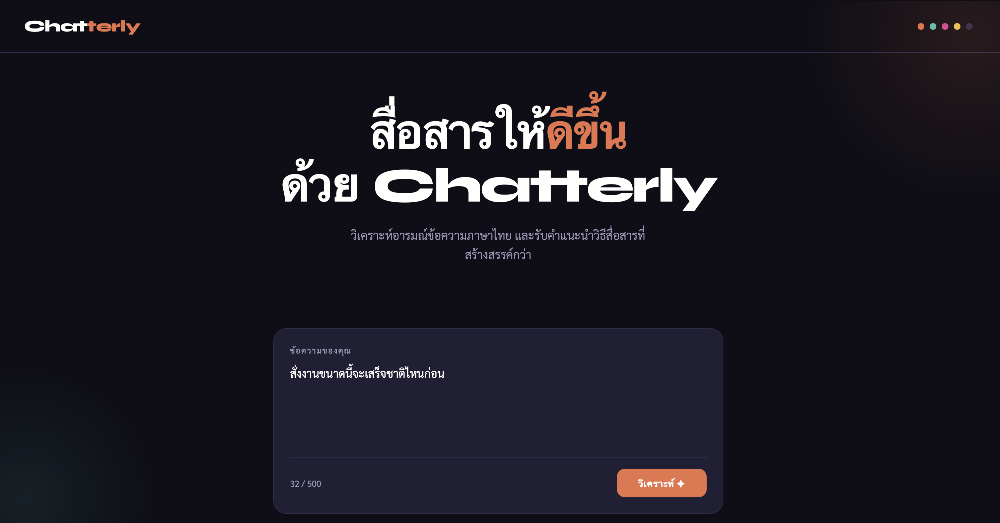

# Chatterly

> **Thai Sentiment Analysis + LLM-powered Communication Assistant**
> วิเคราะห์อารมณ์ข้อความภาษาไทย และแนะนำวิธีสื่อสารที่สร้างสรรค์กว่าด้วย AI
> Evaluated on Wisesight Sentiment benchmark (n=198) — **Accuracy 94%, Macro F1 0.944**

---

## Demo

กรอกข้อความภาษาไทย → ระบบวิเคราะห์ sentiment แบบเรียลไทม์ และถ้าเป็นเชิงลบจะแนะนำข้อความที่สื่อสารได้ดีกว่าให้ทันที

<p align="center">
  
</p>

|  หน้าแรก (กรอกข้อความ)  |  ผลวิเคราะห์ + AI Rewrite  |
|:---:|:---:|
|  |  |
| กรอกข้อความที่ต้องการวิเคราะห์ | sentiment + ความมั่นใจ + Before/After |

---

## Project Structure

```
chatterly/
├── templates/
│   ├── index.html              # Web UI หลัก (วิเคราะห์ + rewrite)
│   └── about.html              # หน้าเกี่ยวกับโปรเจกต์ (route /about)
├── static/                     # ไฟล์ static (assets)
├── app.py                      # Main Flask app + Sentiment + Groq Rewriter
├── evaluate.py                 # Evaluation script (Wisesight benchmark)
├── requirements.txt            # Dependencies (app + evaluation)
├── .env.example                # Template สำหรับ API Key
├── .gitignore
├── LICENSE
└── README.md
```

**Routes:**

| Route | Method | หน้าที่ |
|-------|--------|--------|
| `/` | GET | หน้าหลัก — กรอกข้อความเพื่อวิเคราะห์ |
| `/analyze` | POST | รับข้อความ → sentiment + rewrite (JSON) |
| `/about` | GET | หน้าเกี่ยวกับโปรเจกต์ |

---

## Features

### Thai Sentiment Analysis
ใช้ **WangchanBERTa** (Thai BERT) วิเคราะห์ sentiment ข้อความภาษาไทย จำแนกเป็น 3 class

| Class | ความหมาย |
|-------|---------|
| 😊 pos | เชิงบวก |
| 😐 neu | เป็นกลาง |
| 😞 neg | เชิงลบ |

---

### LLM-powered Rewriter
เมื่อตรวจพบข้อความเชิงลบ → **Groq (Llama 3.3 70B)** จะ rewrite ให้เป็นข้อความที่สื่อสารได้ดีกว่า โดยยังคงความหมายหลักไว้

**Flow:**
```
User input
    ↓
PyThaiNLP Tokenization
    ↓
WangchanBERTa Sentiment Classification
    ↓
ถ้า Negative → Groq LLM Rewriter
    ↓
แสดงผล Before / After แบบ side-by-side
```

---

## Evaluation Results

ทดสอบบน **Wisesight Sentiment** benchmark (Thai NLP standard dataset)

| Metric | Score |
|--------|-------|
| **Accuracy** | **94.00%** |
| **Macro F1** | **0.944** |
| Avg Confidence | 95.72% |

**Per-class Metrics:**

| Class | Precision | Recall | F1 | Support |
|-------|-----------|--------|----|---------|
| pos | 0.967 | 0.879 | 0.921 | 66 |
| neu | 0.887 | 0.955 | 0.920 | 66 |
| neg | 0.985 | 1.000 | 0.992 | 66 |

> neg F1 = 0.992 — แทบ perfect สำหรับ use case หลักของ Chatterly

---

## Tech Stack

| Category | Tools |
|----------|-------|
| Language | Python 3.11 |
| Sentiment Model | WangchanBERTa (Thai BERT) |
| LLM Rewriter | Groq API · Llama 3.3 70B |
| Thai NLP | PyThaiNLP |
| Backend | Flask |
| Frontend | HTML · CSS · JavaScript |
| Evaluation | Wisesight Sentiment · scikit-learn |

---

## Setup

### 1. Clone repo
```bash
git clone https://github.com/nannapasm005-hub/chatterly.git
cd chatterly
```

### 2. Install dependencies
```bash
pip install -r requirements.txt
```

### 3. ตั้งค่า API Key
```bash
cp .env.example .env
```
แก้ไข `.env`:
```
GROQ_API_KEY=your_groq_api_key_here
```
> สมัคร Groq API Key ฟรีได้ที่ https://console.groq.com

> ⚠️ **จำเป็นต้องมี** — ถ้าไม่มี `.env` หรือไม่ได้ตั้ง `GROQ_API_KEY` แอปจะไม่ start (raise error ทันที) เพราะฟีเจอร์ rewrite ต้องใช้ Groq API

### 4. Run
```bash
python app.py
```
เปิด http://localhost:5000

> 📦 **ครั้งแรกที่รัน** โมเดล WangchanBERTa (~400MB) จะถูกดาวน์โหลดจาก Hugging Face อัตโนมัติ อาจใช้เวลาสักครู่ — รอจนขึ้น `Model loaded!` ใน terminal ก่อนเปิดเว็บ (ครั้งต่อไปจะโหลดจาก cache เร็วขึ้น)

---

## Evaluation

รัน evaluation script บน Wisesight Sentiment:

```bash
# โหลด dataset ก่อน
curl -L https://raw.githubusercontent.com/PyThaiNLP/wisesight-sentiment/master/neg.txt -o wisesight_neg.txt
curl -L https://raw.githubusercontent.com/PyThaiNLP/wisesight-sentiment/master/neu.txt -o wisesight_neu.txt
curl -L https://raw.githubusercontent.com/PyThaiNLP/wisesight-sentiment/master/pos.txt -o wisesight_pos.txt

# รัน evaluation
python evaluate.py
```

ผลลัพธ์จะถูกบันทึกเป็น:
- `chatterly_evaluation.png` — Confusion Matrix + F1-score chart
- `chatterly_eval_results.json` — ตัวเลข metrics ทั้งหมด

---

## What I Learned

**Thai NLP:** WangchanBERTa ทำงานได้ดีมากกับข้อความภาษาไทยทั่วไป โดยเฉพาะ negative class (F1 = 0.992) แต่ยังสับสนระหว่าง pos และ neu บ้างเนื่องจาก boundary ของทั้งสองไม่ชัดเจนเสมอไป

**LLM Integration:** การใช้ Groq API ร่วมกับ sentiment model ทำให้ระบบไม่ได้แค่ detect ปัญหา แต่ยัง suggest solution ได้ด้วย ซึ่งเพิ่ม value จริงๆ ให้กับผู้ใช้

**Evaluation:** Wisesight เป็น benchmark มาตรฐานของ Thai NLP ทำให้ตัวเลขที่ได้มีความน่าเชื่อถือและเปรียบเทียบกับงานอื่นได้

---

## Future Improvements

- [ ] รองรับการวิเคราะห์หลายประโยคพร้อมกัน (batch)
- [ ] เพิ่ม emotion detection (โกรธ / เศร้า / กังวล) นอกจาก pos/neu/neg
- [ ] Fine-tune WangchanBERTa บน domain-specific data
- [ ] Deploy บน cloud (Render / Railway)

---

## Dataset

[Wisesight Sentiment](https://github.com/PyThaiNLP/wisesight-sentiment) — PyThaiNLP

Thai social media text · 3 classes (pos/neu/neg) · benchmark มาตรฐาน Thai NLP

---

## License

เผยแพร่ภายใต้สัญญาอนุญาต **MIT** — ดูรายละเอียดที่ไฟล์ [LICENSE](LICENSE)
